# ColorCovid

A collaboration between [Faculty of Pharmacy](https://www.ulisboa.pt/en/unidade-organica/faculty-pharmacy) and [IST](http://tecnico.ulisboa.pt/), both from the [University of Lisbon](https://www.ulisboa.pt/).

Given a photograph of an array of COVID-19 test samples, ColorCovid automatically detects each sample well, extracts its color characteristics, and classifies which tests are positive.

<p align="center">
  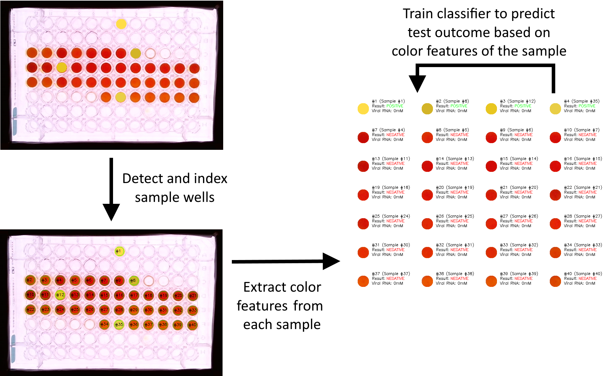
</p>

## Features

- **Camera control** — connect any camera to the computer and capture snapshots directly from the GUI
- **Sample detection** — automatically locates and uniquely indexes each well in the plate, handling variable array layouts, well shapes, and lighting conditions
- **Color feature extraction** — computes HSV and RGB channel averages per sample and exports them to CSV
- **Classification** — classifies each sample as positive or negative based on its color features

## Requirements

```bash
pip install opencv-python numpy matplotlib scikit-image scipy pillow imutils easygui
```

## How It Works

The image processing pipeline detects and segments individual wells through five stages:

<details open>
  <summary><b>Processing steps</b></summary>
<br>

| | |
:----:|:------:
Original image<br>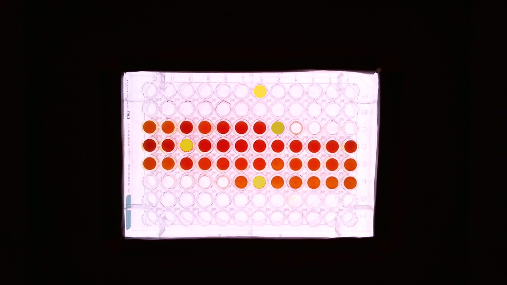 | **Step 1** Detect the background<br>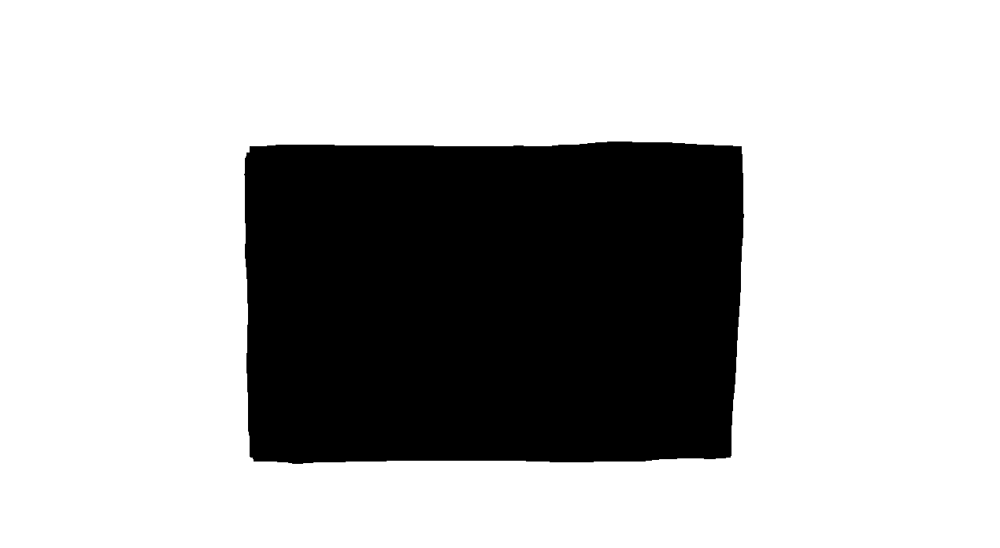
**Step 2** High-saturation threshold to broadly locate the wells<br>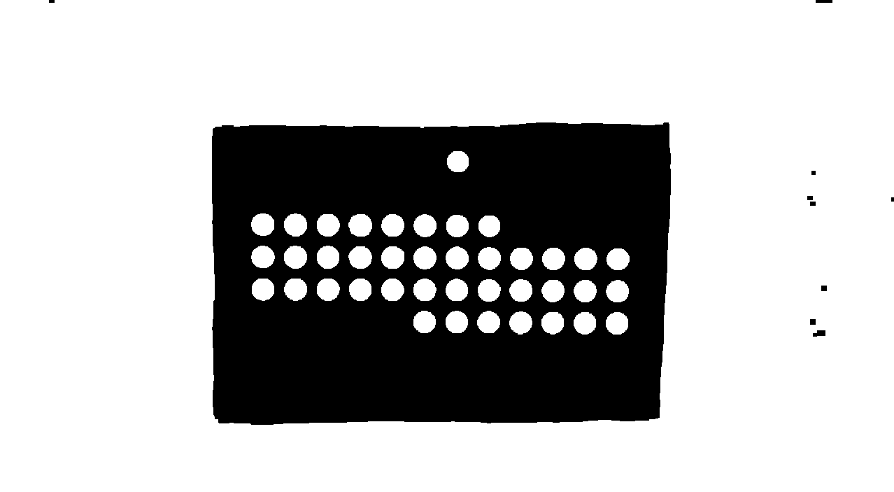 | **Step 3** Remove the background<br>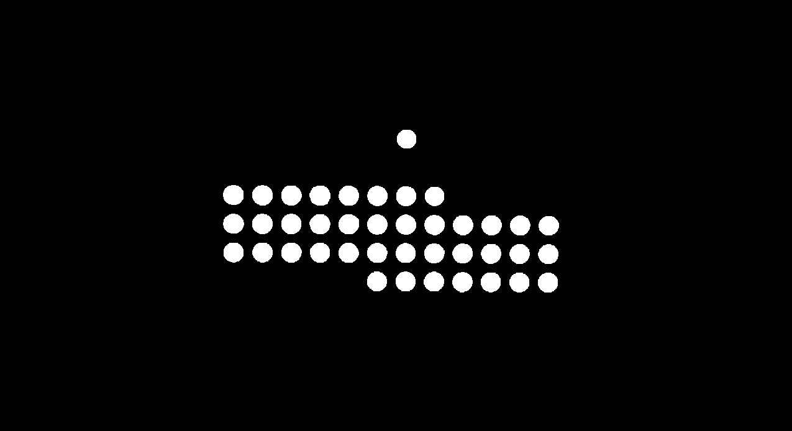
**Step 4** Euclidean distance mask<br>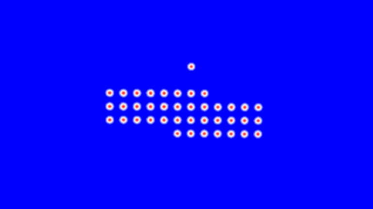 | **Step 5** Watershed algorithm — final sample markers<br>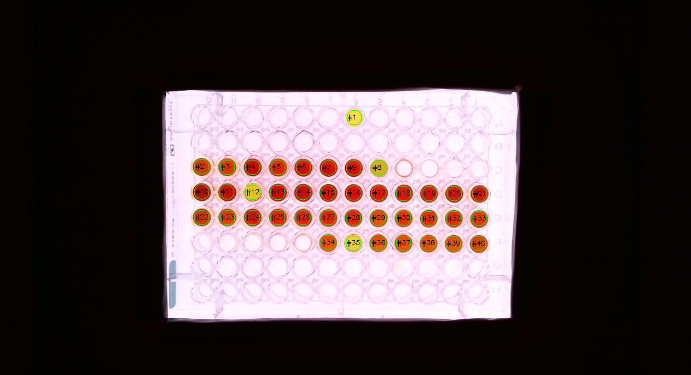

</details>

Detection works across a range of plate formats and lighting conditions:

<details>
  <summary><b>Detection examples</b></summary>
<br>

| Original | Detected samples |
:----:|:------:
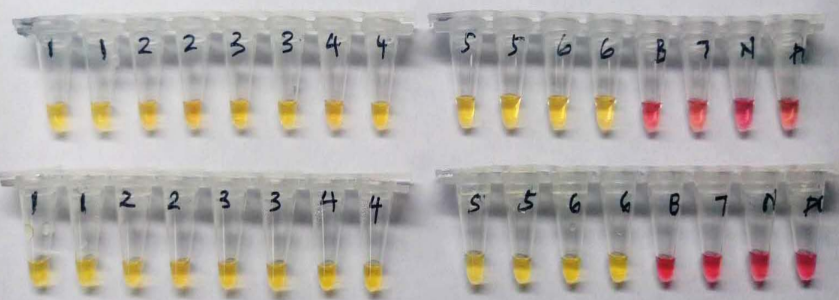 | 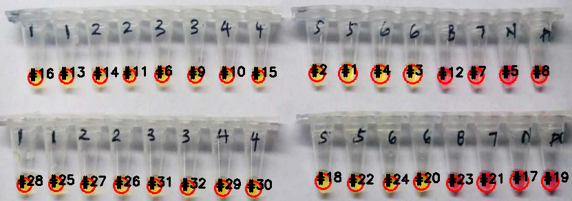
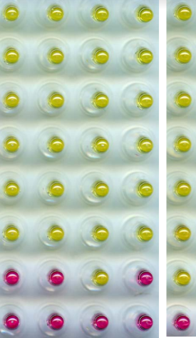 | 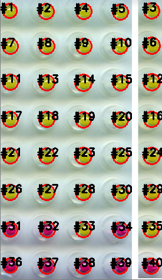
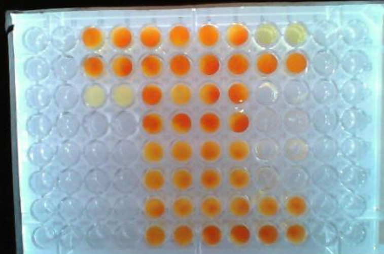 | 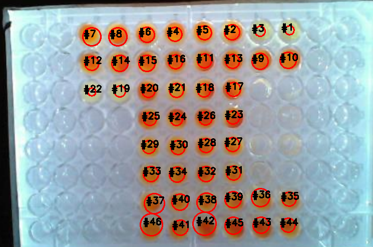
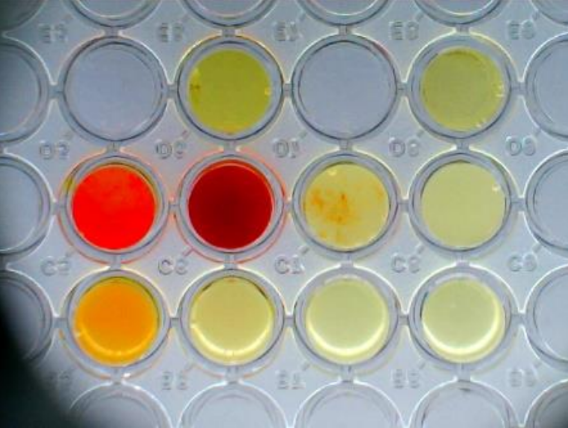 | 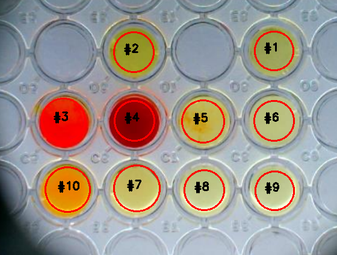

</details>

## Color Analysis

Each detected sample is uniquely indexed on the plate:

<p align="center">
  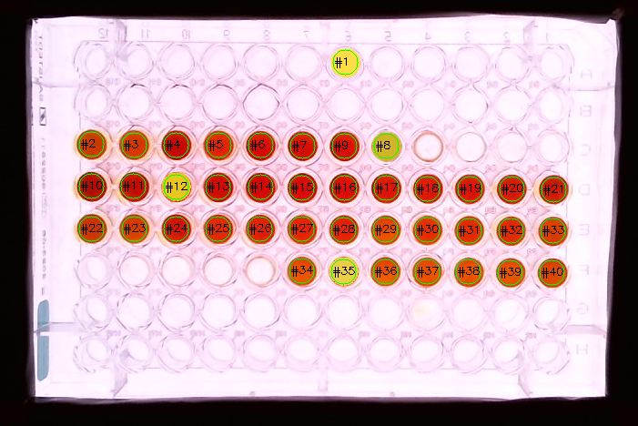
</p>

Color features (H, S, V, R, G, B averages) for all samples are exported to a CSV file:

<p align="center">
  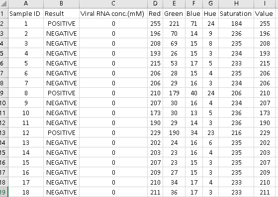
</p>

A built-in visualization tool lets you inspect each sample individually and browse all color data at a glance:

<p align="center">
  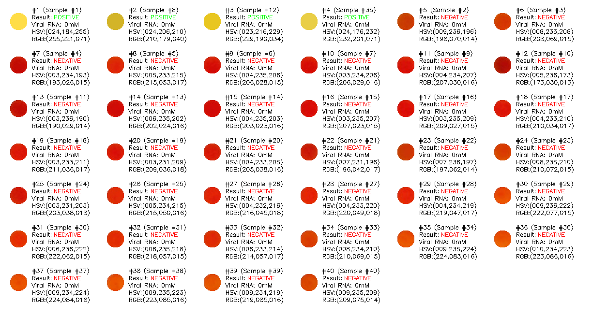
</p>

Samples can be shown with their surrounding border or cropped tightly to the region of interest:

| With border | Cropped to ROI |
:----:|:------:
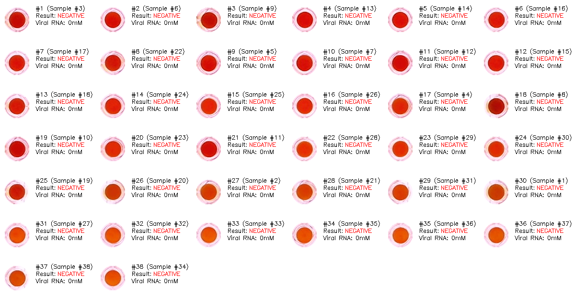 | 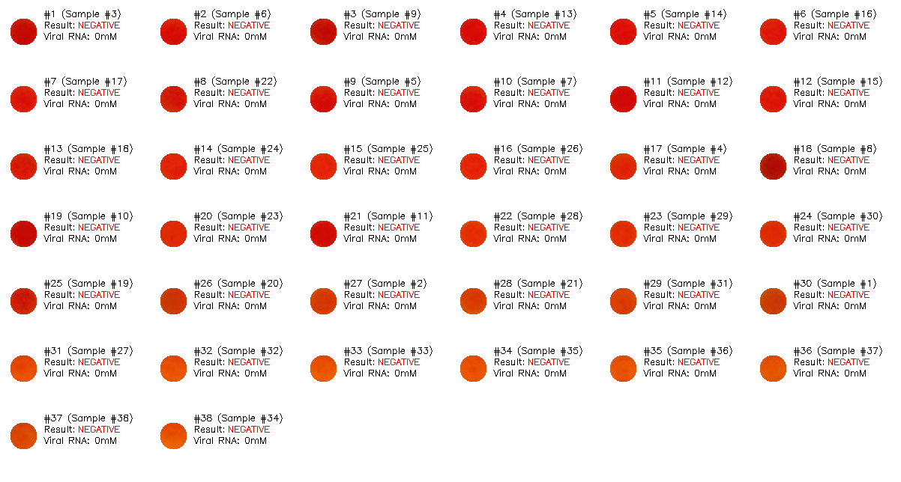

The list can be sorted by any parameter — color channel, test result, or sample index:

| By RGB value (red channel) | By test result | By sample index |
:----:|:------:|:----:
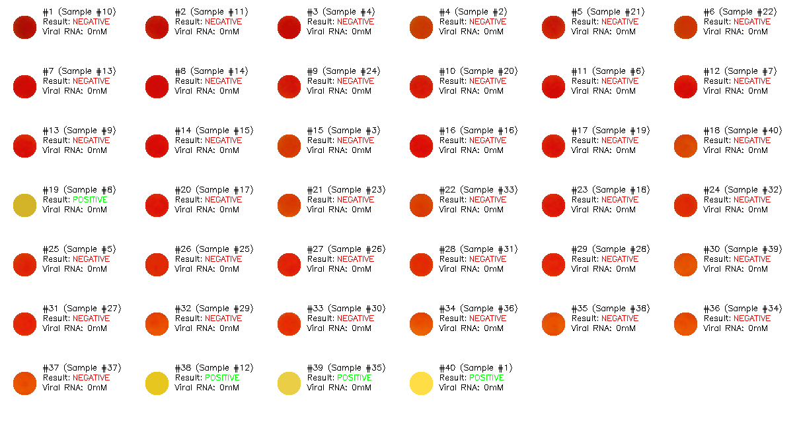 | 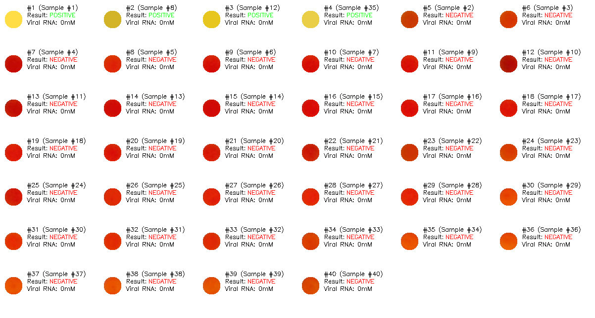 | 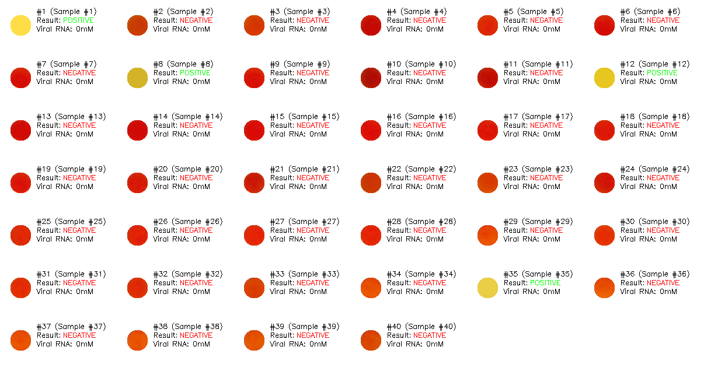

## Author

Rafael Correia — [LinkedIn](https://www.linkedin.com/in/joserafaelcorreia/)
